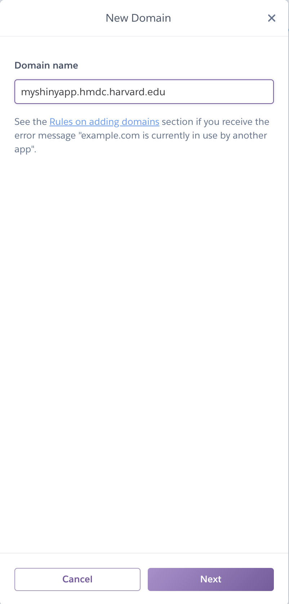
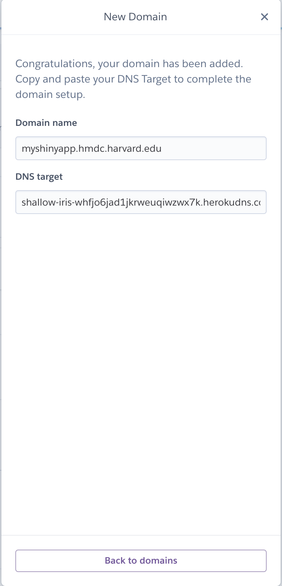
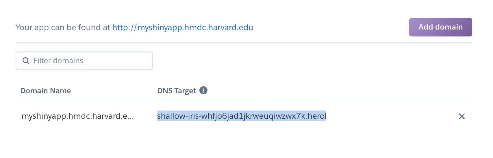

# Setting up a custom domain for your Shiny app


Before you can setup an SSL certificate and custom domain for your Shiny app, you must have deployed your application first.


Ready to assign a custom domain for your Shiny app? 

We can offer ```*.hmdc.harvard.edu``` subdomains or you can bring your own. 
If you would like an HMDC sub-domain, please e-mail [support@help.hmdc.harvard.edu](mailto:support@help.hmdc.harvard.edu?subject=I%20need%20a%20hmdc%20subdomain%20for%20my%20heroku%20app) after completing the following instructions.

## Enabling automatic or manual SSL certificate management

In the Heroku dashboard, go to your app and click on the *Settings* tab, pictured below using ```my-docker-r-example-app``` as an example.


Scroll down and click on *Configure SSL*.


Select *Automatic* if you're not bringing your own custom SSL certificates, or *Manually* if you are. Continue through the screens as shown below until you're brought back to the settings page.


Now, you're ready to configure your custom domain.

## Configuring your custom domain

Underneath the *Configure SSL* button, click **Add domain**.

* Enter your custom domain or HMDC sub-domain and click **Next**.



* Heroku will return a new hostname for your app. Use this hostname in the next section. If you entered an HMDC sub-domain, provide this custom domain to support and skip the next section.





## Adding a DNS CNAME entry

Most domain registration services  - GoDaddy, Google Domains, Hover - have their own DNS service. Create a ```CNAME``` from your domain to the returned DNS target. After fiteen minutes, depending on DNS refresh rate, your custom domain should be accessible and display your app when visited.