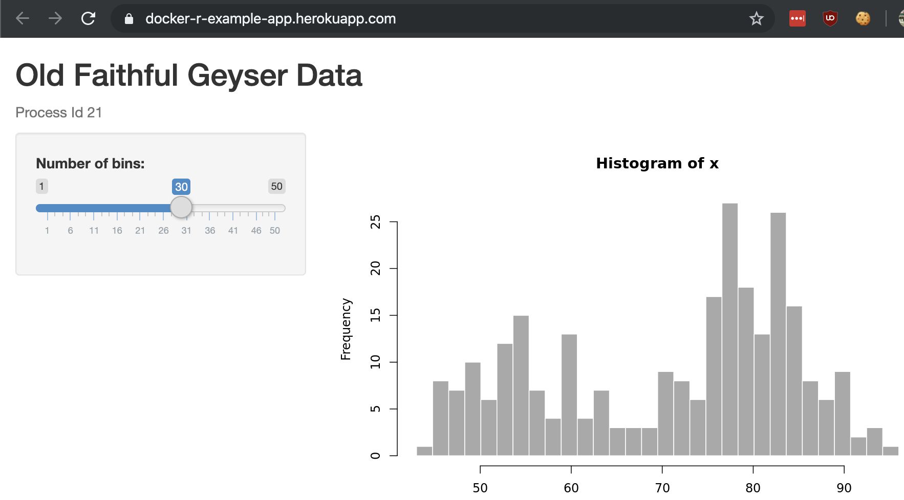

By the end of this section, you will have a working Shiny app running on Heroku which looks like this:



# Clone the example repository
Clone the repository from the command line and open the resultant directory: heroku-docker-r-example-app
```
git clone https://github.com/hmdc/heroku-docker-r-example-app.git
cd heroku-docker-r-example-app
```
You can also ```git clone``` using the repository's SSH url if you have your
SSH keys configured in GitHub. This is the preferred way, but, it is un-necessary.
```
git clone git@github.com:hmdc/heroku-docker-r-example-app.git
cd heroku-docker-r-example-app
```
# Login to Heroku on the command line
Run ```heroku login```. This will open a browser window. Make sure to click *Login via SSO* entering g-harvard as the SSO name, as shown in the screenshots below.

# Deploy the application to Heroku
You are now logged into Heroku via the CLI.

# Wait...