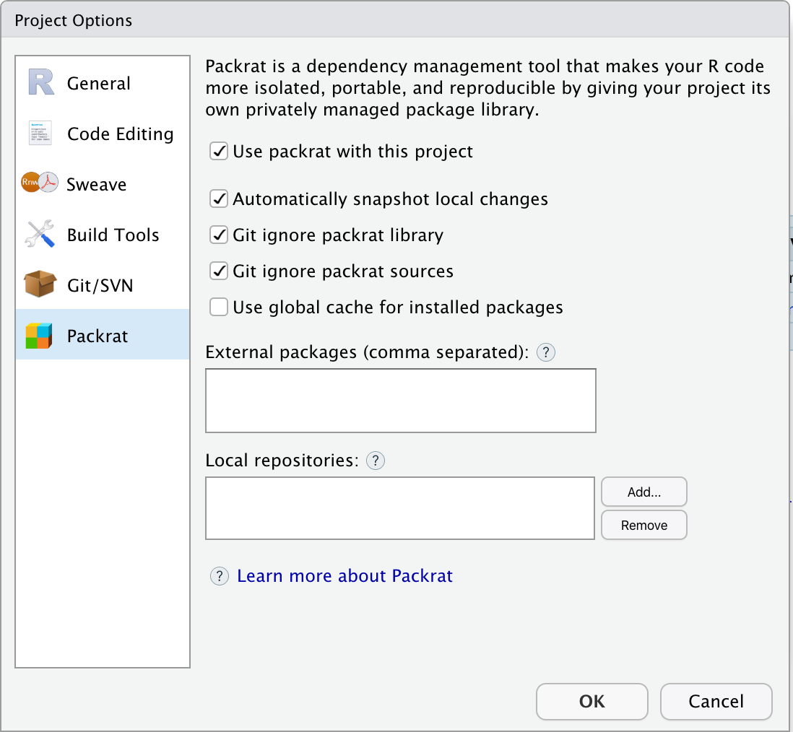

You can use RStudio to develop your Shiny application, whether starting a new application or migrating an already existing application. Follow these tips to ensure your RStudio workflow is optimized for Shiny on Heroku.

# Creating a new project

## From GitHub
If you cloned the [heroku-docker-r-example-app](https://github.com/hmdc/heroku-docker-r-example-app) as a template, when creating a new
project in RStudio select *Version Control*

Click **Tools** → **Project Options** → **Packrat**. 

Make sure that the following checkboxes are all selected. This will speed up your deployment process after the initial deploy.

* ✔️ Use packrat with this project
* ✔️ Automatically snapshot local changes
* ✔️ Git ignore packrat library
* ✔️ Git ignore packrat sources

## From scratch