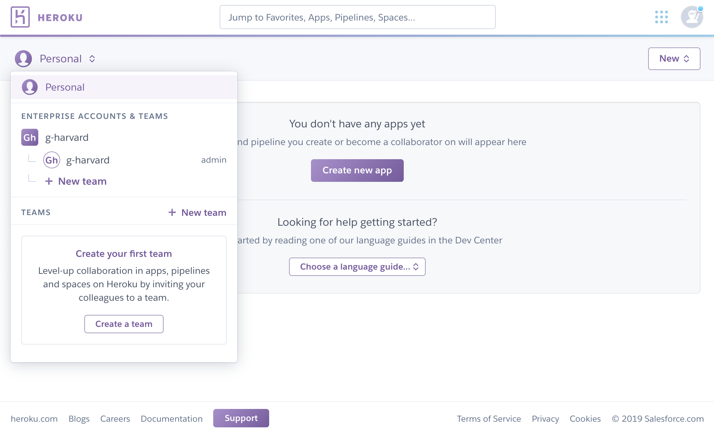

If your onboarding application has been approved, you should have access to Heroku via Harvard Key. [Login to Heroku](https://sso.heroku.com/saml/g-harvard/init) and double-check that you have access to the ```g-harvard``` Heroku team.


Always use this [Login to Heroku](https://sso.heroku.com/saml/g-harvard/init) link. Do not make your own account on Heroku by mistake. Only accounts authenticated through Harvard Key will have access to the ```g-harvard``` team.


If you see a dashboard like the one pictured below, you're good. Continue to the next section. You will learn how to setup your environment and deploy an example R Shiny application to Heroku.



If you're unable to login, please email [support@help.hmdc.harvard.edu](mailto:support@help.hmdc.harvard.edu?subject=I%20can%20not%20login%20to%20Heroku).