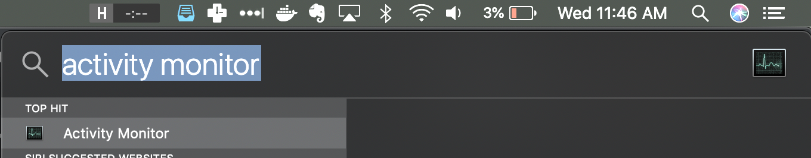
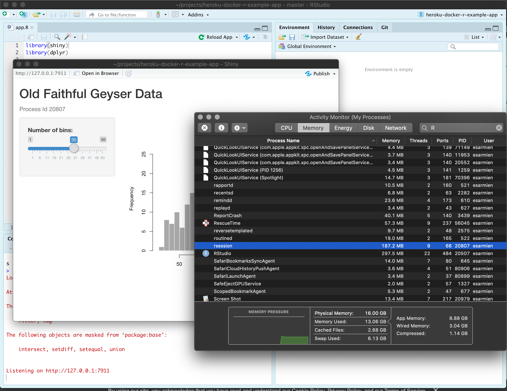

Does your R Shiny application consume less than 512 megabytes of ram? Let's find out.

# Dynos are tiny virtual machines
All applications deployed to Heroku, including your R Shiny application, are executed on dynos. Dynos are, for the sake of simplicity, tiny virtual machines with resource limits.

The default memory limit for a Standard 1X Heroku dyno is 512MB. Standard 2X dynos provide 1GiB of memory, while Performance M and Performance L dynos provide 2.5GB and 14GB respectively.

R Shiny apps take up a lot of memory, but, there are a few tricks you can use to build performant, small-footprint R applications.

While we prefer to reduce your application's footprint, we understand that some applications require more. However, using anything above a *Standard 1X* dyno will require additional consulting with the Shiny team at IQSS.

# How do I find out how much memory my application uses?

## For Windows
* Run your Shiny application locally through RStudio or the command line
* [Open the Task Manager](https://www.howtogeek.com/66622/stupid-geek-tricks-6-ways-to-open-windows-task-manager/).
* Look for ```R.exe``` or ```rsession.exe```.
* How much memory is being used?

## For OS X
* Run your Shiny application locally through RStudio or the command line.
* Open the Activity Monitor. Typing "Activity" in Spotlight, accessed by clicking
the magnifying class in the upper-right hand corner, should immediately show Activity Monitor as a top hit. 

* Look for ```R``` or ```rsession```.
* How much memory is being used?

### Example



# My app uses over 512 MB of ram. Can I still apply?
Continue with the onboarding process. RStudio does add some overhead compared to the vanilla R runtime which is used on Heroku. If your app is using substantially over 512 MB, continue with the onboarding process but be aware that you will most likely need to make substantial optimizations to your R code. We can also point you in the right direction to in-person R programming assistance on campus.