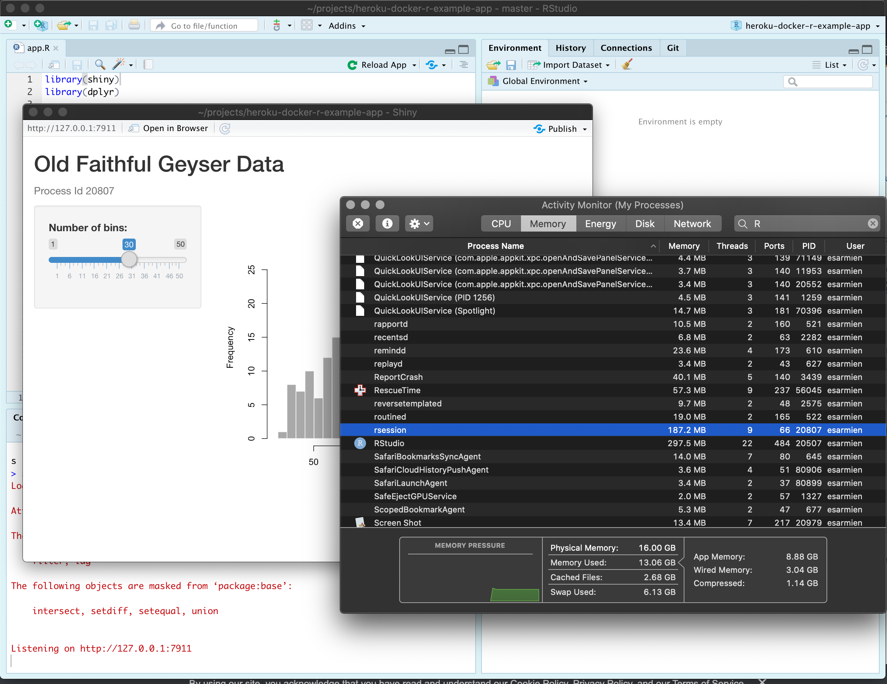

Does your R Shiny application consume less than 512 megabytes of ram? Let's find out.

# Dynos are tiny virtual machines
All applications deployed to Heroku, including your R Shiny application, are executed on dynos. Dynos are, for the sake of simplicity, tiny virtual machines with resource limits.

The default memory limit for a Standard 1X Heroku dyno is 512MB. Standard 2X dynos provide 1GiB of memory, while Performance M and Performance L dynos provide 2.5GB and 14GB respectively.

R Shiny apps take up a lot of memory, but, there are a few tricks you can use to build performant, small-footprint R applications.

While we prefer to reduce your application's footprint, we understand that some applications require more. However, using anything above a *Standard 1X* dyno will require additional consulting with the Shiny team at IQSS.

# How do I find out how much memory my application uses?

## For Windows
* Run your Shiny application locally through RStudio or the command line
* Open the Activity Monitor
* Look for R.exe
* How much memory is it?

## For OS X
* Run your Shiny application locally through RStudio or the command line
* Open the Activity Monitor
* Look for ```rsession```. 

### Example
