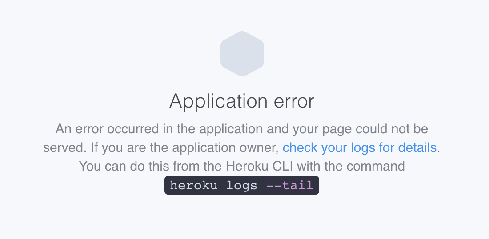

# Resolving Application Error screen

When trying to access your Shiny application, do you see the screen below?



If so, something is wrong with your application. The most common culprits are listed below in order of their likeliness:

* You ran out of system memory. See [Limiting the number of R Threads](../config/NumRThreads.md)

* You're installing a package from GitHub rather than CRAN. See [Using Packrat](../deploy/UsingPackrat.md).

* You're using ```packages.install()``` outside of ```init.R```, in your R server function. See [Using Packrat](../deploy/UsingPackrat.md)

* A required R library has a system-level dependency that isn't articulated in your ```Aptfile```. See [Adding System Packages](../config/AddSystemPackages.md)

* You're trying to install ```rJava``` without installing a JDK. See [Adding System Packages](../config/AddSystemPackages.md)

How can you determine which of the above (or, if you're lucky - an entirely different problem) is responsible for your application crash? Read on!
