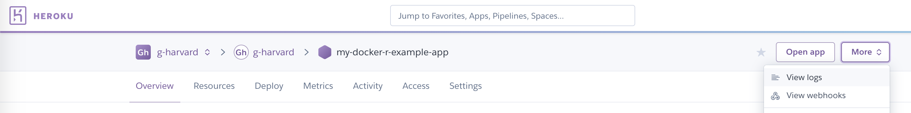

# Viewing App Logs

You can view your Shiny application's logs either through the CLI or through the Heroku dashboard. 

## Using the CLI
Run the following - replacing ```docker-r-example-app``` with the name of your application.

```bash
heroku logs -a docker-r-example-app -t
```

## Using the Heroku dashboard

Open your application in the Heroku dashboard, click **More** and then **View Logs**.



../images/view-logs.png)

## Common log entries

Look for

```bash
Error R14 (Memory quota exceeded)
```

This means you ran out of memory. You may need to change the number of R Threads running, optimize your application, or choose a larger dyno size.

In addition, look for R runtime or library errors. These errors can be preempted before deploying your app publically by [running your application locally with Docker first.](../deploy/DevelopLocallyWithDocker.md)