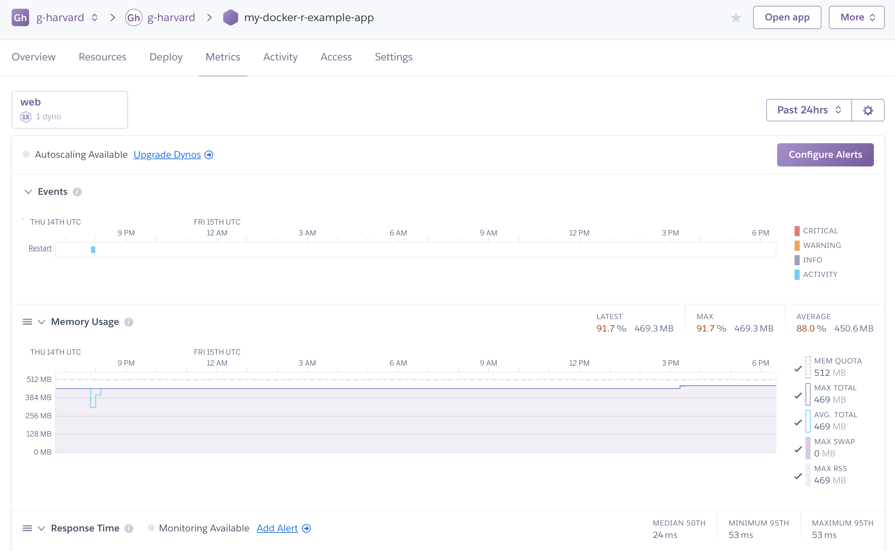

# Viewing resource consumption

You can view how much memory and cpu your application is using on Heroku. In addition, Heroku will provide you details on your application's latency over time, helping you optimize for any number of concurrent web users.

Open the Heroku dashboard, view your application, and click **All Metrics**.

As you can see, the example application which runs 2 R Threads is using close to 100% of it's memory allocation.
